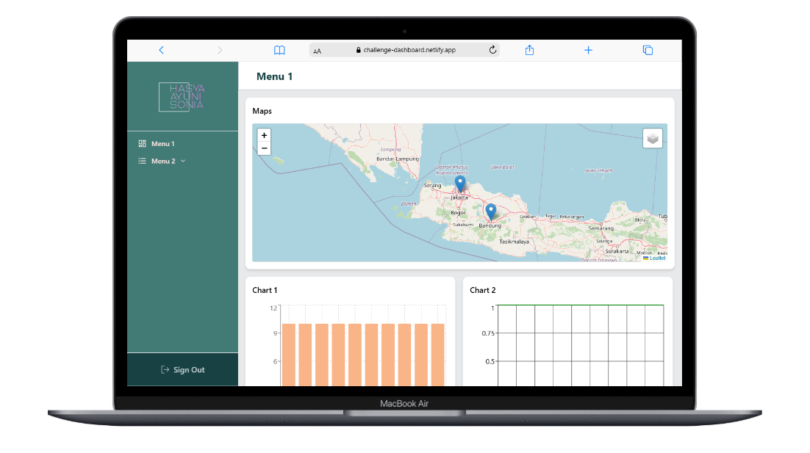
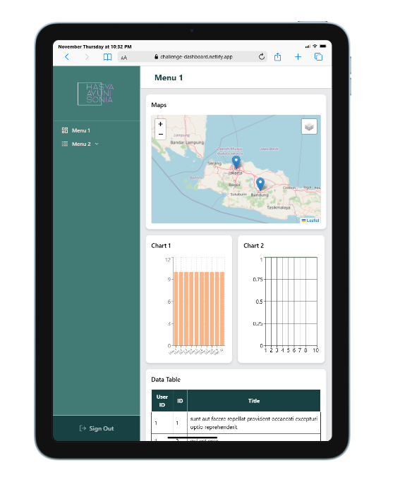
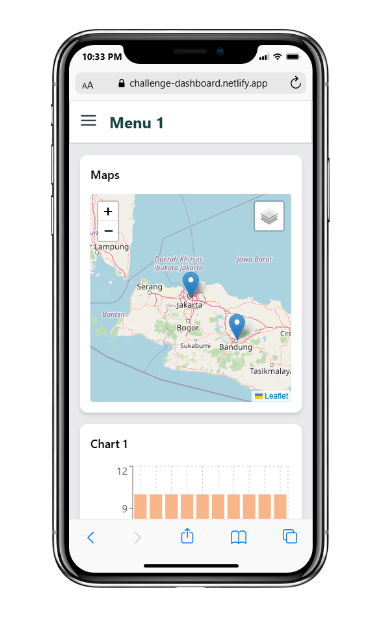
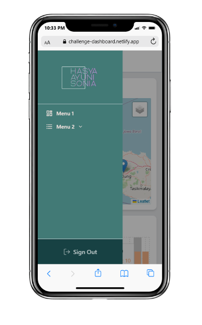

# Agro Techno Solution – Challenge Project

This project was developed as part of the technical challenge from Agro Techno Solution.  
The application is built using React with several supporting libraries to display data, visualize information, and render an interactive map.

---

## Tech Stack

This project uses the following technologies:

- Node v22.17.0
- React + Vite
- JavaScript
- Tailwind CSS
- Axios
- Leaflet.js
- Recharts
- Additional supporting libraries when needed during development

---

## Project Overview

This application is created based on the requirements provided in the challenge. The main objectives include:

- Fetching and displaying data from an API
- Visualizing data using charts
- Displaying map coordinates using Leaflet.js
- Maintaining a clean and responsive UI using Tailwind CSS

---

You can access the website at the following link [here](https://challenge-dashboard.netlify.app/)

## Screenshots (Responsive Preview)

These screenshots show how the UI adapts on desktop, tablet, and mobile devices.

### **Desktop**

  

### **Tablet**

  

### **Mobile**

  

  

